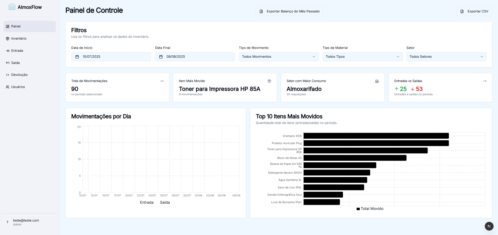
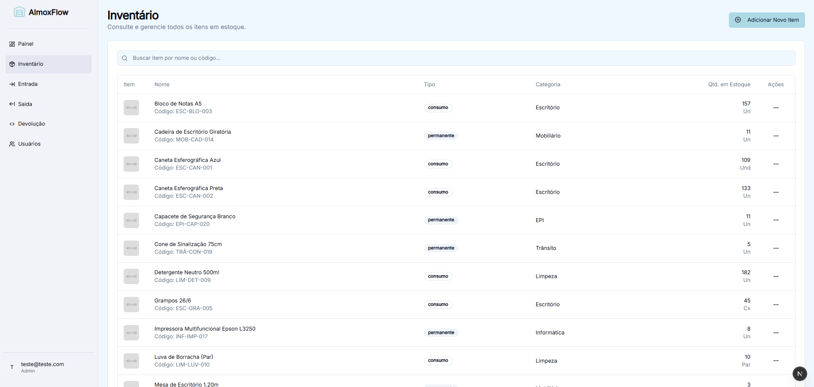
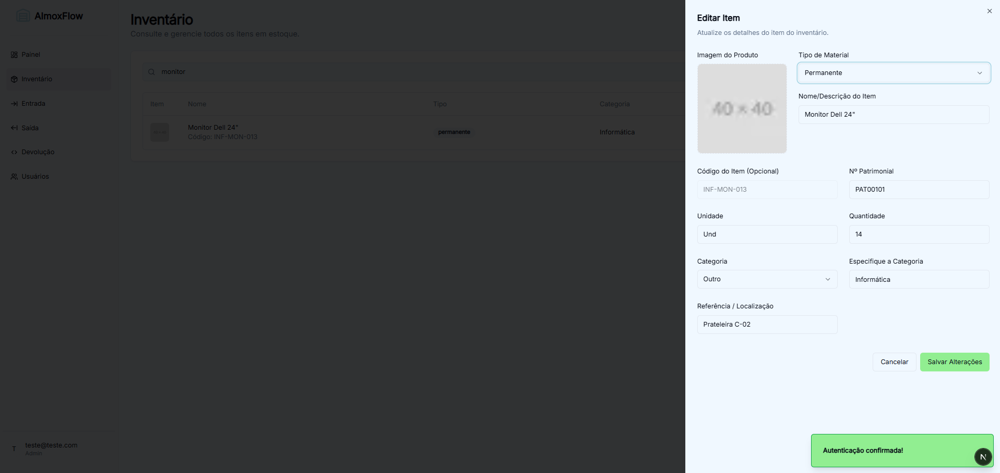
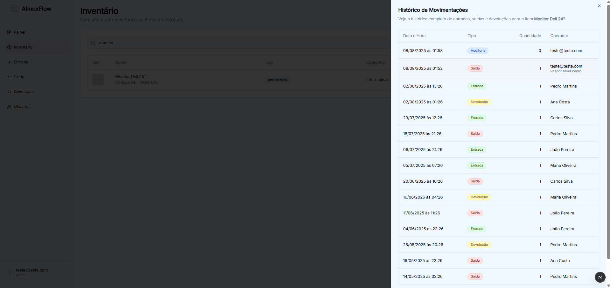
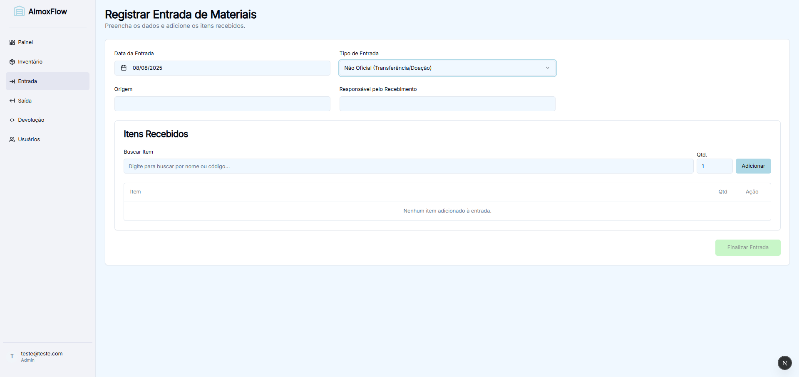
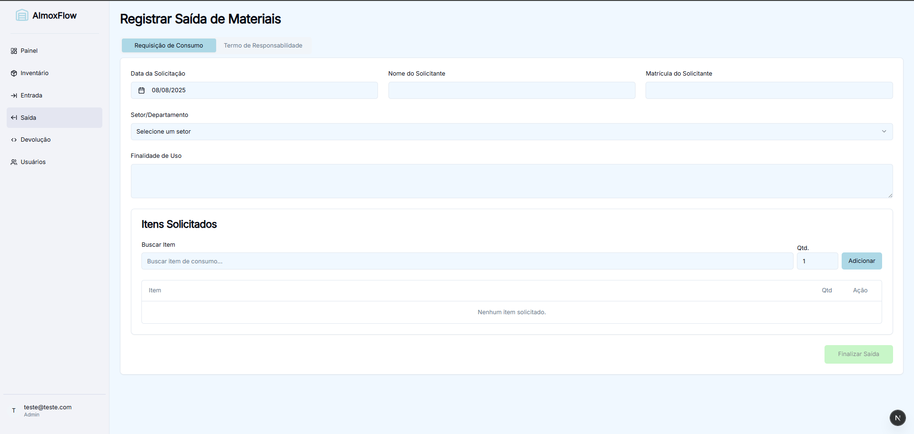
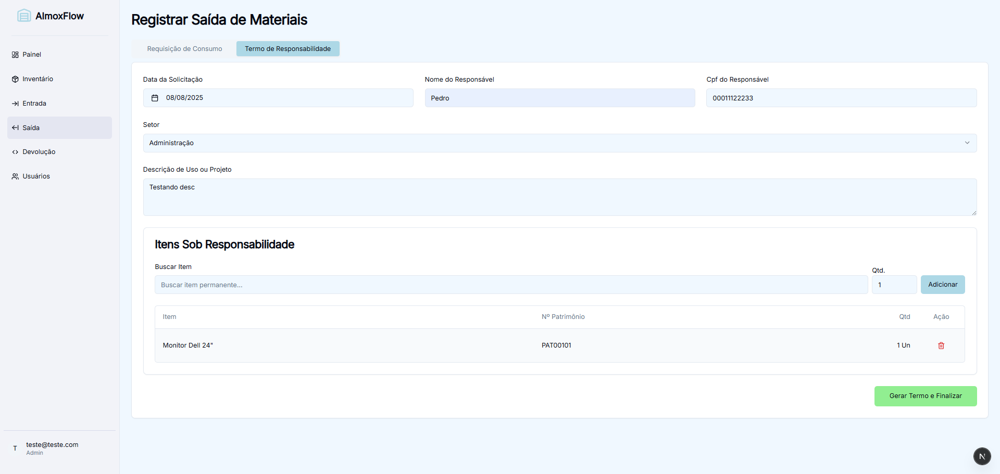
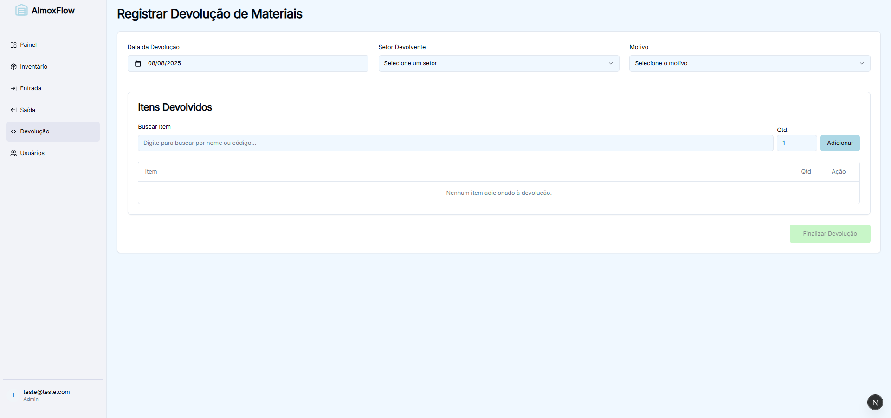
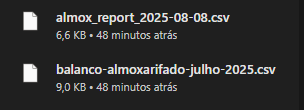

# AlmoxFlow - Sistema de Gerenciamento de Estoque

AlmoxFlow é um sistema web completo para gerenciamento de inventário e almoxarifado, projetado para ser uma solução moderna e eficiente para o controlo de entrada e saída de materiais. Construído com Next.js e Firebase, o projeto oferece uma interface de utilizador reativa e um backend robusto e escalável.

Este projeto foi desenvolvido como um sistema de portfólio para demonstrar competências em desenvolvimento full-stack com tecnologias modernas.

## ✨ Funcionalidades

* **Autenticação de Utilizadores:** Sistema de login seguro com diferenciação de papéis (Administrador e Operador)
* **Dashboard Analítico:** Painel de controlo com visão geral das movimentações, gráficos de entradas/saídas, itens mais movimentados e consumo por setor, com filtros por período 
    
* **Gestão de Inventário:**
    * Visualização, busca e filtragem de todos os itens do estoque
    
    * Adição e edição de produtos, com upload de imagens 
    
    * Visualização do histórico completo de movimentações por item
    
* **Registo de Movimentações:**
    * **Entrada:** Formulário para registar a entrada de materiais, seja por compra (com nota fiscal) ou doação/transferência 
    
    * **Saída:** Módulo para registar a saída de materiais, com formulários distintos para itens de consumo e itens permanentes (gerando Termo de Responsabilidade em PDF)
    
    
    * **Devolução:** Formulário para registar a devolução de materiais ao almoxarifado
    
* **Exportação de Dados:** Funcionalidade para exportar relatórios de movimentações em formato CSV 
    

## 🚀 Tecnologias Utilizadas

* **Frontend:**
    * [Next.js](https://nextjs.org/) (com App Router)
    * [React](https://react.dev/)
    * [TypeScript](https://www.typescriptlang.org/)
    * [Tailwind CSS](https://tailwindcss.com/)
    * [shadcn/ui](https://ui.shadcn.com/)
    * [Recharts](https://recharts.org/)
    * [jsPDF](https://github.com/parallax/jsPDF) & [jspdf-autotable](https://github.com/simonbengtsson/jsPDF-AutoTable)

* **Backend & Base de Dados:**
    * [Firebase](https://firebase.google.com/): Plataforma completa para backend.
        * **Firestore:** Base de dados NoSQL para armazenar produtos, movimentações e utilizadores.
        * **Authentication:** Para gestão de login e papéis de utilizador.
        * **Storage:** Para armazenamento de imagens dos produtos.

## ⚙️ Configuração e Instalação

Siga os passos abaixo para executar o projeto localmente.

### Pré-requisitos

* Node.js (versão 20.x ou superior recomendada)
* NPM ou Yarn
* Uma conta Firebase

### 1. Configuração do Projeto Firebase

1.  Aceda à [Consola do Firebase](https://console.firebase.google.com/).
2.  Crie um novo projeto (ou use um existente). O nome do projeto neste repositório é "AlmoxFlow".
3.  Adicione um novo aplicativo Web ao seu projeto.
4.  Copie as credenciais do Firebase (`firebaseConfig`) que lhe são fornecidas.
5.  Ative os seguintes serviços no seu projeto Firebase:
    * **Authentication:** Ative o provedor "E-mail/Senha".
    * **Firestore Database:** Crie uma nova base de dados.
    * **Storage:** Ative o armazenamento de ficheiros.

### 2. Instalação Local

1.  Clone o repositório:
    ```bash
    git clone https://github.com/seu-usuario/seu-repositorio.git
    cd seu-repositorio
    ```
2.  Instale as dependências:
    ```bash
    npm install
    ```
3.  Crie um ficheiro de ambiente na raiz do projeto chamado `.env.local`:
    ```bash
    touch .env.local
    ```
4.  Adicione as suas credenciais do Firebase (que copiou no passo 1.4) ao ficheiro `.env.local`:
    ```
    NEXT_PUBLIC_FIREBASE_API_KEY=...
    NEXT_PUBLIC_FIREBASE_AUTH_DOMAIN=seu-projeto.firebaseapp.com
    NEXT_PUBLIC_FIREBASE_PROJECT_ID=seu-projeto
    NEXT_PUBLIC_FIREBASE_STORAGE_BUCKET=seu-projeto.appspot.com
    NEXT_PUBLIC_FIREBASE_MESSAGING_SENDER_ID=...
    NEXT_PUBLIC_FIREBASE_APP_ID=1:...
    ```

### 3. Configuração das Regras de Segurança do Firestore

Para que a aplicação funcione corretamente, precisa de aplicar as regras de segurança na sua base de dados Firestore.

1.  Aceda à sua base de dados Firestore na consola do Firebase.
2.  Vá ao separador **"Regras"** ("Rules").
3.  Copie e cole o conteúdo do ficheiro `firestore.rules` do projeto para o editor de regras e publique.

### 4. Executar a Aplicação

Com tudo configurado, inicie o servidor de desenvolvimento:

```bash
npm run dev
```

Abra [http://localhost:3000](http://localhost:3000) no seu browser para ver a aplicação em funcionamento. Crie uma conta e comece a usar!